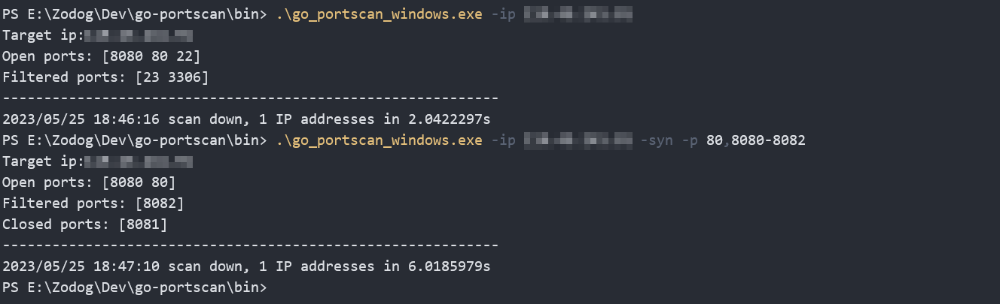

## go-portscan

端口扫描器，支持多线程，支持全连接扫描（connect），支持半开放扫描（syn）

### Usage

使用参数（参数`-h`）：

```shell
Usage of go-portscan:
  -ip string
        ip to scan
  -p string
        ports to scan (default "21,22,23,80,3306,8080")
  -syn
        use syn mode (default connect mode)
  -t int
        scan threads (default 10)
  -open
        only show open ports (default show all results)
  -output string
        simultaneously save output to a file (default do not output to any file)
  -Pn
        no ping probe (default use ping)
  -PT
        use tcp-ping mode (default not use tcp-ping)
  -conTimeOut int
        wait time for port response in connect mode (default 2s)
  -synTimeOut int
        maximum waiting time when no return packet is received in syn mode (default 2s)
```

部分参数说明：

- `-open`：仅显示有 open 端口的结果，默认展示所有结果
- `-Pn`：默认在扫描端口前使用 ping 检测主机是否存活，该参数可以禁用 ping 的存活检测
- `-PT`：使用全连接扫描常见端口来判断主机是否存活，默认关闭
- `-conTimeOut`：程序中全连接的 timeout 时间（在网络条件差时可适当增大）
- `-synTimeOut`：在 syn 模式下未接收到返回数据包时的最大等待时间（在网络条件差或 syn 扫描结果不佳时可适当增大）

### Examples

```shell
./go_portscan -ip 192.168.110.1 -p 80
./go_portscan -ip 192.168.110.1-10 -p 80-85,8080
./go_portscan -ip 192.168.110.1/24 -p 80-85,8080 -t 50
./go_portscan -ip 192.168.110.1/24 -syn -p 80,8080-8082
```

结果示例：



### Todo

- [x] 全连接扫描（connect）
- [x] 半开放扫描（syn）

### Note

1. 半开放扫描需要管理员或 root 权限
2. 半开放扫描可能会出现结果的偏差，建议降低并发数或进行重试
3. 全连接扫描的结果中把端口区分为 Open 和 Filtered，半开放则为 Open、Filtered 和 Closed
4. 如运行 Release 中的二进制文件发生错误，请检查依赖，或参考`build`下脚本的内容重新编译

### Thanks to

[netxfly](https://github.com/netxfly)、[XinRoom](https://github.com/XinRoom)、[Kevin Darlington](https://github.com/kdar)

### JetBrains OS licenses

This project had been being developed with GoLand under the **free JetBrains Open Source license(s)** granted by JetBrains s.r.o., hence I would like to express my thanks here.

<a href="https://www.jetbrains.com/?from=go-portscan" target="_blank"></a>